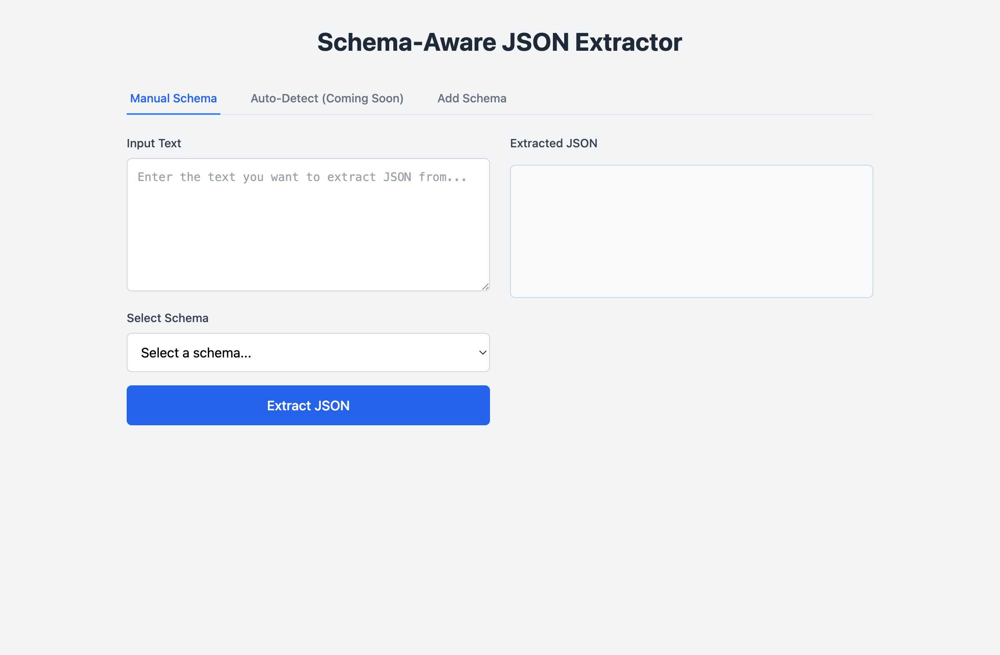
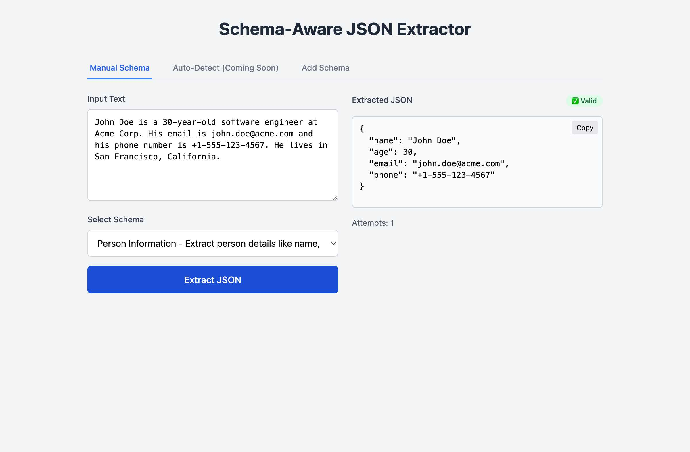
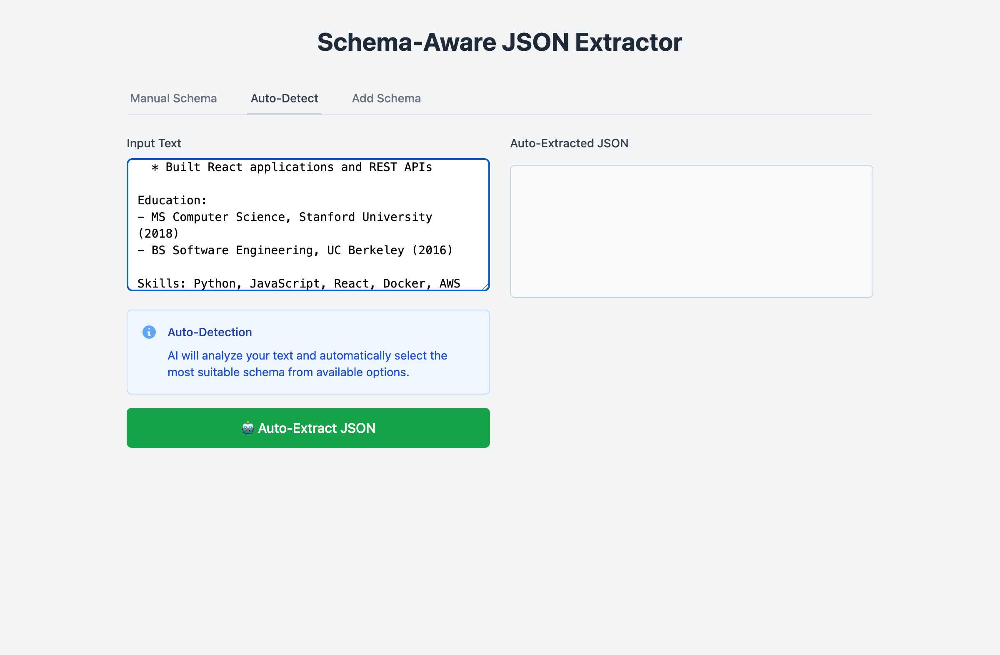
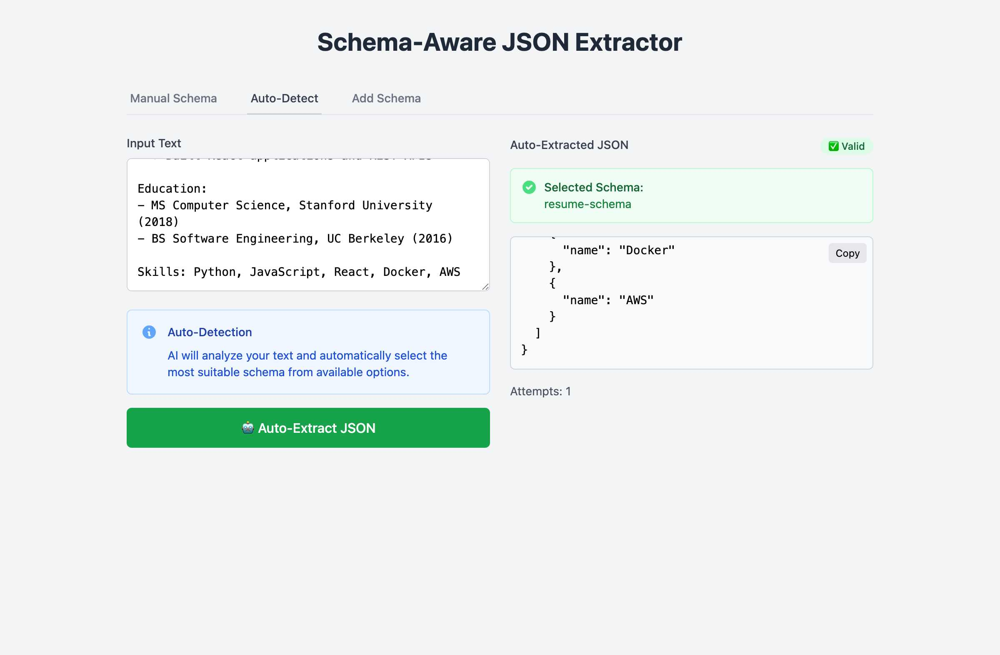
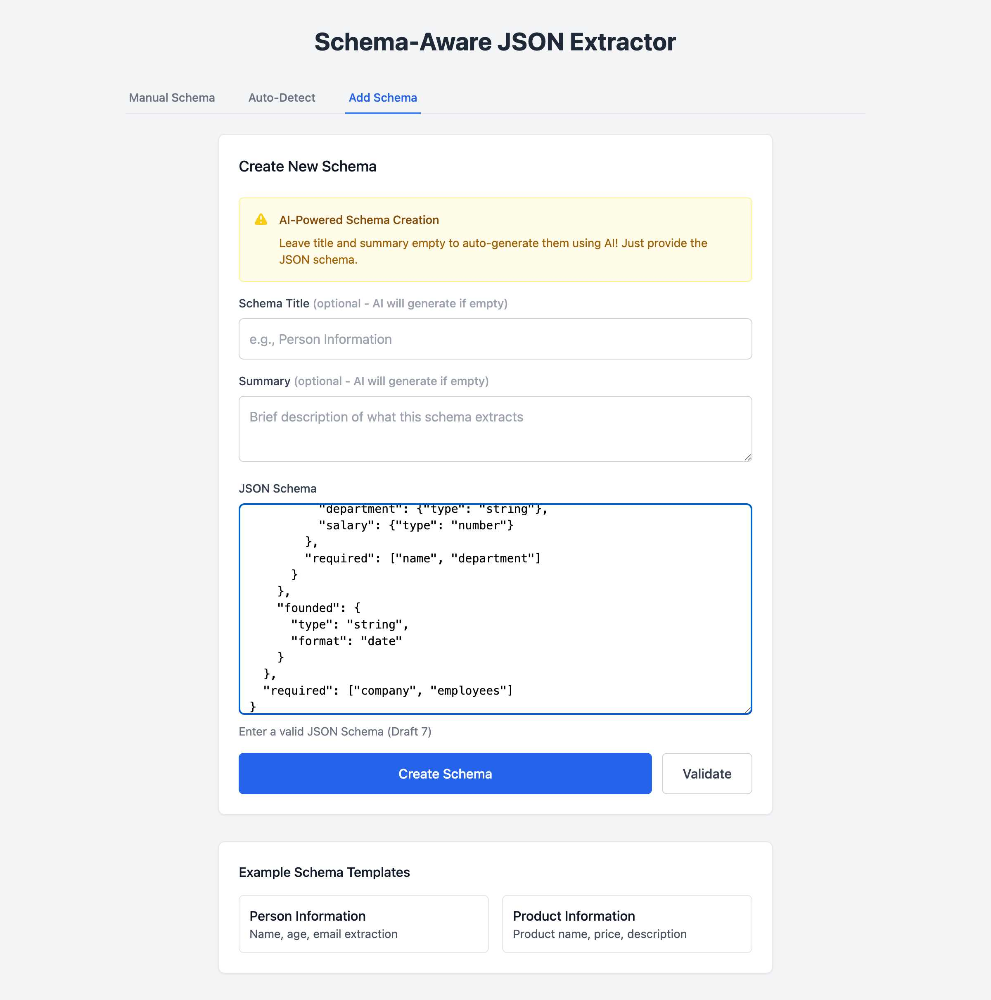

# Schema-Aware JSON Extractor

A powerful web application that extracts structured JSON data from unstructured text using JSON Schema validation and Large Language Model (LLM) processing. Transform any text into structured JSON that conforms to your predefined schemas.

## Features

### 🎯 Core Extraction
- **Schema-Driven Extraction**: Use JSON Schema to define exactly what data you want to extract
- **LLM-Powered**: Leverages Google Gemini 2.5 Flash for intelligent text understanding
- **Auto-Retry Logic**: Automatically retries with validation feedback for improved accuracy
- **Multi-Turn Conversations**: LLM learns from validation errors to improve subsequent attempts

### 🤖 AI-Powered Intelligence (v0.2.0)
- **Auto-Schema Detection**: AI automatically selects the best schema for your text
- **Smart Schema Creation**: Auto-generate titles, summaries, and URL-friendly slugs
- **Contextual Learning**: Each retry attempt includes previous error context for better results

### 🎨 User Experience
- **Clean Web Interface**: Responsive 3-tab UI for manual extraction, auto-detection, and schema creation
- **Real-time Validation**: Instant feedback on extraction results with visual indicators
- **Schema Management**: Create, view, and manage your extraction schemas
- **Template Library**: Pre-built schemas for common use cases

### 📊 Monitoring & Logging
- **Comprehensive Logging**: All LLM interactions, token usage, and costs logged to `services.log`
- **Performance Metrics**: Track success rates, attempt counts, and response times
- **Cost Tracking**: Real-time token usage and pricing information

## Quick Start

### Prerequisites

- Python 3.8 or higher
- Google API key for Gemini access ([Get one here](https://ai.google.dev/gemini-api/docs/api-key))
- `uv` package manager (recommended) or `pip`

### Installation

1. **Clone the repository**:
   ```bash
   git clone <repository-url>
   cd JsonBuilder
   ```

2. **Set up virtual environment**:
   ```bash
   # Using uv (recommended - faster)
   uv venv --python=3.13 

   # Or using pip
   python -m venv .venv

   # Activate the virtual environment
   source .venv/bin/activate  # On Windows: .venv\Scripts\activate
   ```

3. **Install dependencies**:
   ```bash
   # Using uv (recommended - faster)
   uv pip install -r requirements.txt
   
   # Or using pip
   pip install -r requirements.txt
   ```

4. **Set up environment variables**:
   ```bash
   # Copy the example file
   cp .env.example .env
   
   # Edit .env and add your Google API key
   export GOOGLE_API_KEY="your-gemini-api-key-here"
   ```

5. **Run the application**:
   ```bash
   uv run run.py

   (or)

   export GOOGLE_API_KEY="your-gemini-api-key-here" && uv run run.py
   ```

6. **Open your browser** and navigate to `http://localhost:8000`

The application will start on port 8000 with hot reload enabled for development.

## Usage Guide

### Web Interface

The application provides a clean, three-tab interface for easy JSON extraction:



#### 1. Manual Schema Tab - Extract JSON with Predefined Schemas

The main extraction interface allows you to process text using predefined schemas:


1. **Enter your text** in the input area
2. **Select a schema** from the dropdown (includes Person Info, Product Info, etc.)
3. **Click "Extract JSON"** to process
4. **View results** with validation status and copy functionality

**Example Workflow**:
- **Input text**: "John Doe is 30 years old and works at Acme Corp. His email is john@acme.com"
- **Schema**: Person Information
- **Result**: Structured JSON with validation status



The system automatically:
- Validates the JSON against your selected schema
- Shows the number of attempts needed (auto-retry on failures)
- Provides a "Copy" button for easy use of the results

#### 2. Auto-Detect Tab - AI-Powered Schema Selection (v0.2.0)

Let AI automatically choose the best schema for your text:



1. **Enter your text** - no need to select a schema manually
2. **Click "🤖 Auto-Extract JSON"** to let AI analyze your text
3. **AI selects** the most appropriate schema from your available options
4. **View results** with selected schema information



**Benefits**:
- **Time-saving**: No manual schema selection required
- **Smart matching**: AI analyzes content type, structure, and field relevance  
- **Visual feedback**: See which schema was automatically selected
- **Same reliability**: Uses the same validation and retry logic as manual mode

#### 3. Add Schema Tab - Create Custom Schemas with AI Assistance

Create and manage your own extraction schemas with AI-powered metadata generation:



**Schema Creation Process**:
1. **Define JSON Schema**: Use JSON Schema Draft 7 format (required)
2. **Optional metadata**: Leave title and summary empty for AI auto-generation
3. **Validate** your schema syntax before saving  
4. **Create** to add to your schema library with auto-generated slug ID

**AI-Powered Features (v0.2.0)**:
- **Auto-Generated Titles**: AI creates descriptive titles from schema analysis
- **Smart Summaries**: AI generates concise descriptions of schema purpose
- **URL-Friendly Slugs**: Automatic creation of clean, readable schema IDs
- **Manual Override**: You can still provide custom titles and summaries if preferred

**Example Schema**:
```json
{
  "type": "object",
  "properties": {
    "company": {"type": "string"},
    "revenue": {"type": "number"},
    "founded": {"type": "string"}
  },
  "required": ["company"]
}
```

**Template Library**: Choose from pre-built templates for common use cases like Person Information and Product Information to get started quickly.

### API Usage

The application provides a REST API for programmatic access:

#### Extract JSON with Specific Schema
```bash
curl -X POST "http://localhost:8000/extract" \
  -H "Content-Type: application/json" \
  -d '{
    "text": "Apple Inc. was founded in 1976 and generated $394.3 billion in revenue last year.",
    "schema_id": "company-info-001"
  }'
```

#### Auto-Detect Schema and Extract (v0.2.0)
```bash
curl -X POST "http://localhost:8000/extract/auto" \
  -H "Content-Type: application/json" \
  -d '{
    "text": "John Smith is a 30-year-old software engineer at TechCorp. Email: john@techcorp.com",
    "top_k": 10
  }'
```

#### List Available Schemas
```bash
curl "http://localhost:8000/schemas"
```

#### Create New Schema (Manual)
```bash
curl -X POST "http://localhost:8000/schemas" \
  -H "Content-Type: application/json" \
  -d '{
    "title": "Company Information",
    "summary": "Extract company details",
    "schema_data": {
      "type": "object",
      "properties": {
        "name": {"type": "string"},
        "revenue": {"type": "number"}
      }
    }
  }'
```

#### Create Schema with AI Auto-Generation (v0.2.0)
```bash
curl -X POST "http://localhost:8000/schemas" \
  -H "Content-Type: application/json" \
  -d '{
    "schema_data": {
      "type": "object",
      "properties": {
        "name": {"type": "string"},
        "department": {"type": "string"},
        "salary": {"type": "number"}
      },
      "required": ["name", "department"]
    }
  }'
```
*AI will auto-generate title, summary, and slug based on schema analysis*

## Schema Examples

### Person Information
Extract personal details from text:
```json
{
  "type": "object",
  "properties": {
    "name": {"type": "string"},
    "age": {"type": "number"},
    "email": {"type": "string", "format": "email"},
    "phone": {"type": "string"}
  },
  "required": ["name"]
}
```

### Product Information
Extract product details from descriptions:
```json
{
  "type": "object",
  "properties": {
    "name": {"type": "string"},
    "price": {"type": "number"},
    "description": {"type": "string"},
    "category": {"type": "string"},
    "in_stock": {"type": "boolean"}
  },
  "required": ["name", "price"]
}
```

## API Reference

### Endpoints

| Method | Endpoint | Description |
|--------|----------|-------------|
| `POST` | `/extract` | Extract JSON using specific schema |
| `POST` | `/extract/auto` | Auto-detect best schema and extract JSON |
| `GET` | `/schemas` | List all schemas with pagination |
| `GET` | `/schemas/{id}` | Get specific schema |
| `POST` | `/schemas` | Create new schema |
| `DELETE` | `/schemas/{id}` | Delete schema |

### Response Format

Extraction responses include:
- `data`: The extracted JSON object
- `valid`: Boolean indicating schema validation success
- `attempts`: Number of retry attempts used
- `schema_id`: ID of the schema used (especially useful for auto-detection)
- `error`: Error message if extraction failed

## Configuration

### Environment Variables
- `GOOGLE_API_KEY`: Required Google Gemini API key
- `SCHEMAS_DIR`: Schema storage directory (default: `schemas/`)

### Schema Storage
Schemas are stored as JSON files in the `schemas/` directory. Each file contains:
- `id`: Unique identifier
- `title`: Human-readable name  
- `summary`: Description of what the schema extraits
- `schema_data`: The actual JSON Schema definition

## Development

### Project Structure
```
JsonBuilder/
├── app/
│   ├── api/routes.py          # API endpoints
│   ├── services/extractor.py  # LLM extraction logic
│   ├── repositories/schema_repo.py  # Schema management
│   ├── models.py              # Data models
│   ├── main.py                # FastAPI application
│   └── ui/templates/index.html # Web interface
├── schemas/                   # Schema storage
├── run.py                     # Development server
├── DESIGN.md                  # System architecture
└── IMPLEMENTATION.md          # Implementation details
```

### Running in Development Mode
```bash
uv run run.py
```
This starts the server with hot reload enabled on `http://localhost:8000`.

### API Documentation
Visit `http://localhost:8000/docs` for interactive OpenAPI documentation.

## Troubleshooting

### Common Issues

**"Google API key is required"**
- Ensure `GOOGLE_API_KEY` environment variable is set: `export GOOGLE_API_KEY="your-key"`
- Verify your API key has Gemini access enabled at [Google AI Studio](https://ai.google.dev)
- Check that your `.env` file contains the correct key (if using one)

**"Schema validation failed"**  
- Use the **Validate** button in the Add Schema tab to check syntax
- Ensure required fields are properly defined in your schema
- Review error messages for specific validation issues
- Verify your schema follows JSON Schema Draft 7 format

**"Extraction failed"**
- Verify your input text contains relevant information for the selected schema
- Try a different schema that better matches your data
- Check if the Gemini API is accessible (try a simple extraction first)
- Monitor the attempts counter - if it reaches 3, the system has exhausted retries

**Port 8000 already in use**
- Kill existing processes: `lsof -ti:8000 | xargs kill -9`
- Or change the port in `run.py`: `uvicorn.run("app.main:app", port=8001)`

### Performance Tips
- **Schema Design**: Use specific, well-defined schemas for better extraction accuracy
- **Input Quality**: Keep input text focused and relevant to your schema
- **Rate Limits**: Monitor API rate limits for high-volume usage (Gemini has generous quotas)
- **Retry Logic**: The system auto-retries up to 3 times on validation failures